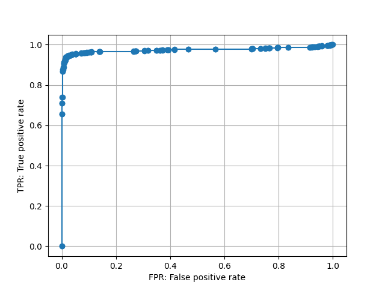

# ALGAN for T-PRISM
### T-PRISMのためのALGAN実装

[T-PRISM：深層学習と論理プログラミングの融合](https://www.jstage.jst.go.jp/article/jjsai/36/4/36_437/_article/-char/ja/)\
小島 諒介, 佐藤 泰介


## How To Use This Code
You will need:

- [PyTorch](https://PyTorch.org/) version 1.8.1 later, matplotlib, scikit-learn.
- Recommendation: [NVIDIA GPU CLOUD PyTorch Docker Container](https://catalog.ngc.nvidia.com/orgs/nvidia/containers/pytorch)

  `nvcr.io/nvidia/pytorch:22.07-py3` satisfies all the requirements.
- The MNIST dataset (Automatically downloaded.)


### 初期値からの訓練
`src` ディレクトリへ移動し `main.py` を実行。GPUの有無は自動で判定する。正常・異常のクラスやパラメタを変更したい場合は `config.py` にて設定する。\
Spectral Normalizationなしのdiscriminatorを使用する際は `main_without_sn.py` を実行。


```sh
cd src
python main.py
```

### 学習済みモデルによる異常検知
`src` ディレクトリ内の `anomaly_detection.ipynb` のセルを上から順に実行。最後のセルにて異常スコアの閾値 `threshold` が設定可能。最終セルは実行するたびに異なるミニバッチが読み込まれる。\
Spectral Normalizationなしのdiscriminatorを使用する際は `anomaly_detection_without_sn.ipynb` を実行。

## ディレクトリ構造とファイルの説明
```
.
├── .devcontainer
├── imgs
├── src
│   ├── anomay_detection.ipynb
│   ├── anomay_detection_without_sn.ipynb
│   ├── config.py
│   ├── main.py
│   └── main_without_sn.py
└── weights
    ├── Dis_highest_performance__iter_1440_epoch_159.pth
    ├── Gen_highest_performance__iter_1440_epoch_159.pth
    └── Dis_highest_performance__iter_1440_epoch_159_without_sn.pth
    
```
- `.devcontainer`

  Dockerfileなどを格納。

- `anomaly_detection.ipynb`

  学習済みの重みを読み込み、異常検知を行うためのnotebook（DiscriminatorにSpectral Normalizationあり）。

- `anomaly_detection_without_sn.ipynb`

  学習済みの重みを読み込み、異常検知を行うためのnotebook（DiscriminatorにSpectral Normalizationなし）。

- `config.py`

  ハイパーパラメタなどの設定を書き込むファイル。

- `main.py`

  初期値から訓練を行う際に実行するファイル。（DiscriminatorにSpectral Normalizationあり）。

- `main_without_sn.py`

  初期値から訓練を行う際に実行するファイル。（DiscriminatorにSpectral Normalizationなし）。

- `Dis_highest_performance__iter_1440_epoch_159.pth`

  MNISTの `0` を正常として学習済みのパラメタ（Discriminator、Spectral Normalizationあり）。

- `Dis_highest_performance__iter_1440_epoch_159.pth`

  MNISTの `0` を正常として学習済みのパラメタ（Discriminator、Spectral Normalizationなし）。

- `Gen_highest_performance__iter_1440_epoch_159.pth`

  MNISTの `0` を正常して学習済みのパラメタ（Generator）。異常検知の際は不要。


## 訓練時のtest setによる結果
MNISTの `0` を正常として学習。

### DiscriminatorにSpectral Normalizationあり
`main.py` で訓練。`anomaly_detection.ipynb` で訓練済みモデルからの異常検知デモが可能。


上段：正常潜在変数\
下段：異常潜在変数\
による生成結果（159 epoch）。


異常スコアのヒストグラム


ROC曲線


AUC
```text
0.998470736312146
```

### DiscriminatorにSpectral Normalizationなし
`main_without_sn.py` で訓練。`anomaly_detection_without_sn.ipynb` で訓練済みモデルからの異常検知デモが可能。


上段：正常潜在変数\
下段：異常潜在変数\
による生成結果（159 epoch）。


異常スコアのヒストグラム


ROC曲線



AUC
```text
0.9739126135035512
```


※ Spectral Normalizationあり・なし双方でIteration 1440, epoch 159がValidation dataに対して最大パフォーマンスとなったのは偶然。


## Misc Notes
If you use this code, please cite
```text
@ARTICLE{murase_fukumizu_algan_2022,
author={Murase, Hironori and Fukumizu, Kenji},
journal={IEEE Access},
title={ALGAN: Anomaly Detection by Generating Pseudo Anomalous Data via Latent Variables},
year={2022},
volume={10},
number={},
pages={44259-44270},
doi={10.1109/ACCESS.2022.3169594}}
```

## Acknowledgments
This paper is based on results obtained from a project, JPNP16007, commissioned by the New Energy and Industrial Technology Development Organization (NEDO).\
This work was supported in part by The Graduate University for Advanced Studies, SOKENDAI.